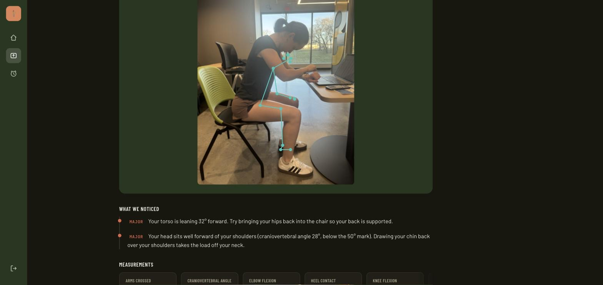

# OpenPosture

[](https://github.com/m-nweke/OpenPosture/actions/workflows/pr.yml)
[](https://github.com/m-nweke/OpenPosture/actions/workflows/containers.yml)
[](https://github.com/m-nweke/OpenPosture/actions/workflows/scientific-validation.yml)
[](https://github.com/m-nweke/OpenPosture/actions/workflows/e2e.yml)
[](https://github.com/m-nweke/OpenPosture/actions/workflows/integration.yml)

**Upload a photograph of yourself sitting. Get back angles measured from your own body, and an
honest account of what could not be measured.**



Everything in that screenshot is computed. The skeleton comes from MediaPipe Pose Landmarker and
the angles from a pure rules engine, measured in world space so your distance from the camera
does not change the answer.

The line about the arms, *"left elbow and left wrist were unclear"*, is the part worth noticing:
the engine declines to answer rather than guessing. A measurement it cannot make is reported as a
gap with the reason, never as a reassuring default.

---

## Quickstart

No accounts, no API key, nothing to download.

```bash
git clone https://github.com/m-nweke/OpenPosture.git
cd OpenPosture
docker compose up
```

Then open <http://localhost:5173>, register any email and password, and upload a photo of yourself
sitting, **taken from the side**.


The stack publishes `5432` (Postgres), `9000` and `9001` (MinIO and its console) alongside the app.
If you already run Postgres locally, `docker compose up` fails with *"port is already allocated"* —
put `POSTGRES_PORT=5433` in a `.env` file and nothing else changes, because the API reaches the
database over the Compose network rather than through the published port.

The API image carries the pose model, fetched at build time with its SHA256 pinned, so the first
`docker compose up` produces real analysis with no extra steps. Working on the frontend and don't
want to wait for inference? `OPENPOSTURE_POSE_BACKEND=fake docker compose up` runs the entire stack
with a synthetic skeleton and no model at all.

## What it measures

Seven metrics, in world space rather than pixels:

| Metric | What it says |
| --- | --- |
| `trunk_inclination_deg` | Signed lean of hip-mid → shoulder-mid against gravity |
| `craniovertebral_angle_deg` | Forward-head posture; below 50° is forward |
| `arms_crossed` | Forearm-to-upper-arm ratio, normalised by torso |
| `elbow_flexion_deg` | Elbow angle |
| `knee_flexion_deg` | Hip–knee–ankle angle |
| `heel_contact_m` | Whether your feet are actually on the floor |
| `view_confidence` | Whether the photo is lateral enough to trust the rest |

Any of them can return a **gap** instead of a number, naming the keypoints that were unclear. A
report made entirely of gaps is a successful request with an honest answer, not an error.

## How it is built

```
apps/web        React + TypeScript. Types generated from the API's OpenAPI schema.
apps/api        FastAPI. Uploads, storage, errors, structured logging.
packages/pose-backends    MediaPipe adapter behind a Protocol, plus a fake for tests.
packages/posture-spec     rules.json: every threshold, as data.
packages/posture-core     The rules engine. numpy and the standard library, nothing else.
```

The dependency direction runs one way, right to left, and nothing depends on `apps/web`. That is
what lets the rules engine's 364 tests run in about a second with no model, no container and no
network, which in turn is why there are 364 of them. It is enforced by a test, not by convention.

Three properties the design is built around:

**Angles are measured in world space.** MediaPipe returns landmarks in metres with the hip as
origin, so a person twice as far from the camera produces the same numbers. This is verified as a
property rather than asserted: Hypothesis generates poses, scales them between 0.3x and 3x, and
requires every angular metric to agree to within 1e-6.

```python
# packages/posture-core/tests/test_properties.py
def test_every_angular_metric_is_invariant_to_body_size(pose, scale):
```

**A metric that cannot be computed returns a gap, never a guess.** Every keypoint carries a status
of `ok`, `low_confidence`, `not_detected` or `out_of_frame`, and a metric states which joints it
needs. If they are not usable it abstains and says which ones failed, all the way through to the
UI. Absence of evidence stays distinguishable from evidence of absence.

**Thresholds are data, not literals.** Every tunable lives in
[`rules.json`](packages/posture-spec/src/posture_spec/rules.json) and is loaded into a frozen
dataclass the engine takes as an argument. Retuning is a configuration change, and a test fails if
the file and the dataclass ever disagree.

## Where it came from

This is a rewrite of a 2024 university capstone. The original is preserved under
[`docs/archive/`](docs/archive/) and audited line by line in
[`docs/FINDINGS.md`](docs/FINDINGS.md); three of its defects are worth showing next to their
replacements, because each is a category rather than a typo.

### 1. Thresholds were raw pixels

```python
# posture_image.py:144-145
if (distance < (armdist + 100) and distance > (armdist - 100)):
    # this value 100 is arbitary. this shall be replaced with a calculation
    # which can adjust to different sizes of people.
```

The comment is the original author's. A person standing twice as far from the camera produced half
the pixel separation and the opposite verdict.

**Replacement:** the world-space measurement and the invariance property described above. That
property fails catastrophically against the original engine, and runs on every pull request in
[`scientific-validation.yml`](.github/workflows/scientific-validation.yml).

### 2. Failure was reported as good posture

```python
# posture_image.py — checkPosition() wraps its body in `except Exception` and returns None
if position == 1:    print("Hunchback position")
elif position == -1: print("Reclined back position")
else:                print("Straight back position")   # ← None lands here
```

**Replacement:** a metric that cannot be computed has `value = None`, a status saying which
keypoints failed, and produces a `Gap`. The API returns it as a `201` with `quality.gaps`
populated, and the UI renders it as *"we could not assess this, try a wider shot"*. There is no
code path that turns absence of evidence into evidence of absence. That is enforced by
[boundary and degradation tests](packages/posture-core/tests/test_boundaries.py) that drop each
keypoint in turn and assert nothing raises and nothing is invented.

### 3. The dashboard did not call anything

```tsx
// openpose-react/src/views/Dashboard.tsx — the entire "analysis"
const POSTURE_DETECTION_RESULT = 'Our posture detection model detected you sitting with a ...'
setTimeout(() => { setShowResults(true) }, 5000)
```

Both frontends faked it. Nothing was uploaded and the model was never invoked. `API/app.py` never
imported it, because the legacy `process()` functions referenced module globals assigned under a
`__main__` guard and raised `NameError` on import.

**Replacement:** a real multipart upload with byte-accurate progress, and a
[Playwright journey](apps/web/e2e-stack/analysis.spec.ts) that asserts an **exact measured value**
appears on screen. Asserting "a results panel rendered" would have passed against the code above,
which is why it does not.

## Current limitations

Stated plainly, because a project about honest measurement should be honest about itself.

- **Authentication is a placeholder.** `apps/web/src/auth` really registers accounts and really
  rejects wrong passwords, entirely inside the browser tab. Nothing is stored on a server. Epic E
  replaces it with self-hosted JWT.
- **Nothing is persisted.** Uploads land in a volume; analyses are not saved and there is no
  history view. Also Epic E.
- **No LLM coaching yet.** The findings are the engine's own wording. Epic F adds a coach that is
  told the numbers and forbidden from contradicting them.
- **No live webcam mode.** Epic G.
- **One person per photo**, and the photo must be roughly lateral. `view_confidence` says so when
  it is not, rather than silently answering anyway.
- **Not a medical device.** It measures angles and says what it measured.

---

## Contributors

The original capstone was built by:

1. [Michael Nweke](https://github.com/m-nweke)
2. [Ally Ryan](https://github.com/aerc4d)
3. [Parisha Rathod](https://github.com/parisha8994)

**Ally and Parisha contributed to v1 only.** Their work is preserved in the git history and in
`docs/archive/`, and their copyright stands, but they are not involved in the v2 rewrite. It is
maintained solely by Michael Nweke. Please do not direct v2 issues, questions, or review requests
to them.

---

## Development (v2)

New here? [`CONTRIBUTING.md`](CONTRIBUTING.md) covers setup, the architectural rule and the quality
gates. [`docs/adr/`](docs/adr/) records why the stack is what it is. Start with
[ADR-0002](docs/adr/0002-mediapipe-pose.md) (the pose backend) and
[ADR-0005](docs/adr/0005-scale-invariant-metrics.md) (how the original's central correctness defect
is fixed).

### Where the rewrite is

Epics are tracked in Jira project `OP`; the plan they came from is
[`docs/V2-PLAN.md`](docs/V2-PLAN.md).

- **A, Foundation** · done. Workspace, tooling, CI, ADRs, archive.
- **B, Pose backend** · done. MediaPipe adapter, fake backend, checksum-pinned weights, landmark
  CLI.
- **C, Rules engine** · nearly done. Seven metrics, the report, the shared threshold spec and the
  property/boundary/golden suites are merged. Outstanding: the extended scientific property suite
  (mirror consistency, physical domains, confidence monotonicity) and the evaluation-data
  contract.
- **D, Walking skeleton** · done, and tagged `v0.1.0`. FastAPI app factory, lifespan-loaded pose
  backend, storage behind a Protocol, `POST /api/v1/analyses`, Compose with a Vite proxy, the
  rewritten dashboard, generated API types, the canvas overlay and a full-stack Playwright journey.
- **E, Persistence and auth** · in progress. Postgres, MinIO and the bucket bootstrap are in the
  Compose stack with health gating, and the API can already store uploads as objects
  (`OPENPOSTURE_STORAGE_BACKEND=s3`). Still to come: the schema and migrations, the repository
  layer, and self-hosted JWT replacing the in-browser placeholder.
- **F to H** · not started.

The MediaPipe portability spike passed on both `linux/amd64` and `linux/arm64`, so the ONNX
MoveNet fallback the plan held in reserve was cancelled rather than built
([ADR-0002](docs/adr/0002-mediapipe-pose.md)).

Python packaging is a [`uv`](https://docs.astral.sh/uv/) workspace, one lockfile, editable
local packages, no `requirements.txt`.

```bash
# 1. Install uv (https://docs.astral.sh/uv/getting-started/installation/)
brew install uv

# 2. The workspace targets Python 3.12. Recent macOS ships 3.14, which has no
#    TensorFlow/MediaPipe wheels, so install the pinned interpreter explicitly:
uv python install 3.12

# 3. Install every workspace member, editable, into one environment
uv sync --all-packages
```

Then:

```bash
uv run ruff check .              # lint
uv run ruff format .             # format
uv run mypy packages apps        # strict type check
uv run pytest -m "not model"     # tests, skipping those needing real model weights
```

The rules-engine and adapter suites (527 tests) run in about a second and a half, with no model
download, no container and no database.

### Seeing it work

The web stack is the quickstart above. The engine is also demoable on its own from the command
line, which is the faster loop when the change is in the rules rather than in the UI. The fake
backend needs nothing installed beyond the workspace:

```bash
uv run python -m pose_backends.cli --backend fake --preset hunchback --report
```

```
score          70/100
assessed       7 of 7 metrics

Findings
  [major] Your torso is leaning 32° forward. Try bringing your hips back into the chair so your
          back is supported.
          confidence 0.95  (trunk_inclination_deg)
  ...
```

`--preset` takes `straight`, `hunchback`, `reclined`, `kneeling` or `partial_occlusion`. Drop
`--report` for the raw landmark table, add `--json` for machine-readable output, and note that
`partial_occlusion` reports honest *gaps* rather than a verdict, the behaviour the original
engine got wrong.

For a real photograph you need the weights and the inference stack:

```bash
make fetch-model                                       # pinned SHA256, writes to models/
uv pip install "mediapipe==0.10.18"                    # optional extra, ~857 MB
uv run python -m pose_backends.cli fixtures/images/desk_hunch.jpeg --report
```

Exit codes are distinct on purpose: `0` a report was printed, `1` no pose was detected in the
image, `2` the backend could not run.

### Frontend

The React app lives in `apps/web` and has its own npm toolchain, it is not part of the uv
workspace.

```bash
cd apps/web
npm ci                    # exact lockfile install, same as CI

npm run dev               # dev server on :5173
npm run lint              # oxlint
npm run format:check      # prettier
npm run typecheck         # tsc, strict
npm run test              # vitest
npm run test:coverage     # vitest with the 70% floor CI enforces
npm run test:e2e          # playwright, against a production build
npm run build             # production build
```

Authentication is a placeholder. `apps/web/src/auth` exports an in-memory implementation that
really registers accounts and really rejects wrong passwords, but stores everything in the tab
and nothing on a server. Epic E replaces it with an API-backed provider satisfying the same
`AuthContextValue` interface; no component should need to change.

Optionally mirror the CI lint jobs on every commit:

```bash
uv tool install pre-commit && pre-commit install
```

### Continuous integration

`.github/workflows/pr.yml` runs on every pull request and on every push to `main`. Toolchain
setup lives in one composite action, `.github/actions/setup-project`, so the workflows planned
for this repo cannot drift apart on versions or cache keys.

| Job                            | Gate                                              |
| ------------------------------ | ------------------------------------------------- |
| `changes`                      | Decides which areas a change touched              |
| `lint`                         | `ruff check` + `ruff format --check`              |
| `typecheck`                    | `mypy --strict`                                   |
| `test-python (3.11 \| 3.12)`   | `pytest`, 95% floor on `posture-core`, 85% on `apps/api` |
| `contract`                     | Regenerates the OpenAPI schema and TS types; fails on committed drift |
| `web-lint`                     | oxlint + Prettier                                 |
| `web-typecheck`                | `tsc`, strict                                     |
| `web-test`                     | Vitest, 70% floor                                 |
| `web-build`                    | Production build must succeed                     |
| `web-e2e`                      | Playwright against that production build          |
| **`ci-ok`**                    | **Aggregates all of the above**                   |

**`ci-ok` is the only check the `main` ruleset should require** (OP-15). The jobs above it skip
routinely (a Python-only change skips all five `web-*` jobs, and vice versa) and a ruleset
naming them individually would depend on how GitHub treats skipped checks. Requiring the
aggregator also means a job can be renamed or split without silently dropping protection.

Path filtering is per job, never at the workflow level: a workflow that never runs never reports,
so a required check would sit pending forever and a docs-only pull request could not merge.
Changes to `pr.yml` or the composite action run *everything*, and so does every push to `main`.

Three further workflows exist.

**`scientific-validation.yml`** runs on pull requests, pushes to `main` and on demand, in three
jobs aggregated by `scientific-ok`: the invariance and degradation properties, boundary behaviour
at every threshold, the golden report corpus (regenerated and diffed, so stale snapshots cannot
ride along), and a drift check that `rules.json` and the engine's `Thresholds` still describe the
same numbers. `pr.yml` asks *did this change break the software*; this asks *is the engine still
measuring the same thing*. They fail for different reasons, which is why they are separate
workflows with separate aggregators.

`scientific-ok`, `containers-ok`, `e2e-ok` and `integration-ok` are **not** currently in the `main`
ruleset's required checks, only `ci-ok` is. See
[`.github/main-ruleset.md`](.github/main-ruleset.md) for why, and for the command that adds them.

**`integration.yml`** runs on every pull request, aggregated by `integration-ok`. It starts
Postgres, MinIO and the bucket bootstrap from a clean state and proves the things only a real
service can prove: that the healthchecks gate their dependants, that Postgres answers over TCP
rather than only on its unix socket, that the bucket exists, that bootstrapping twice is not an
error, and that the API can put an object in MinIO — path-style addressing and all, which the
moto-backed unit tests accept either way. It builds no application image, so it is the fast half
of the container story.

**`containers.yml`** and **`e2e.yml`** both run on every pull request, aggregated by
`containers-ok` and `e2e-ok`. The first builds both images, validates Compose, starts the stack,
waits for readiness and smoke-tests it; the second drives a real browser through the whole
application and asserts an exact measured value on screen. Both use the fake pose backend at
runtime, the image still contains the real inference stack, since testing a differently-built
image would prove nothing about the one that ships, so their failures are about wiring rather
than about inference.

**`model-validation.yml`** runs on `workflow_dispatch` only. It verifies the pinned SHA256, then
runs the real MediaPipe weights over the fixture images and uploads landmark and latency
diagnostics. Deliberately unscheduled, so required CI never downloads a model.

### Layout

```
packages/posture-core    pure rules engine, numpy only, no I/O, no globals, no frameworks
packages/posture-spec    rules.json, every threshold as data, plus the loader that parses it
packages/pose-backends   inference adapters behind a Protocol (the heavy, fragile dependency)
apps/api                 FastAPI service: uploads, storage, analysis endpoint
apps/web                 React + TypeScript frontend (own npm toolchain, not in the uv workspace)
docs/adr                 architecture decision records
docs/archive             the original capstone, preserved as audit evidence
fixtures/images          8 curated test images
models                   downloaded weights (gitignored); only checksums.txt is version controlled
```

The dependency direction is one-way, `posture-core` ← `posture-spec` ← `pose-backends` ←
`apps/api`, and nothing depends on `apps/api`. That is what lets the rules-engine suite run in
well under a second with no model, no Docker and no database. It is enforced by
`packages/posture-core/tests/test_dependency_isolation.py`, not just by convention.

`posture-spec` exists because reading a file is I/O and `posture-core` is not allowed to do any.
It also carries the drift test: a threshold that exists in `rules.json` but not in the engine's
`Thresholds` dataclass, or vice versa, is a red build rather than a discovery six weeks later
when the TypeScript mirror (Epic G) turns out to be using a stale default.

## License

[MIT](LICENSE), © 2024-2026 Michael Nweke, Ally Ryan, Parisha Rathod. Ally Ryan and Parisha Rathod
hold copyright for their v1 contributions; v2 is authored by Michael Nweke ([Contributors](#contributors)).

`docs/archive/legacy-openpose/` vendors a third-party Keras implementation of CMU OpenPose under its
own MIT licence (© 2020 Vinay Varma), preserved as audit evidence and imported by nothing. The Keras
weights that code depended on are **not** redistributed here, they were a bare Dropbox link with no
licence or checksum, which is part of why v2 uses MediaPipe instead
([ADR-0002](docs/adr/0002-mediapipe-pose.md)).
